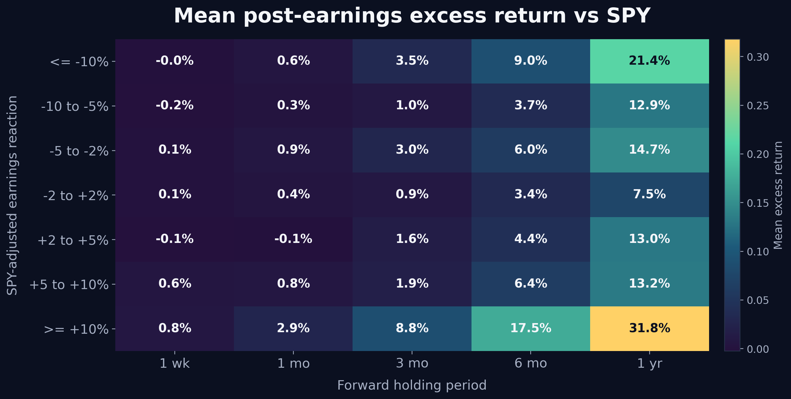
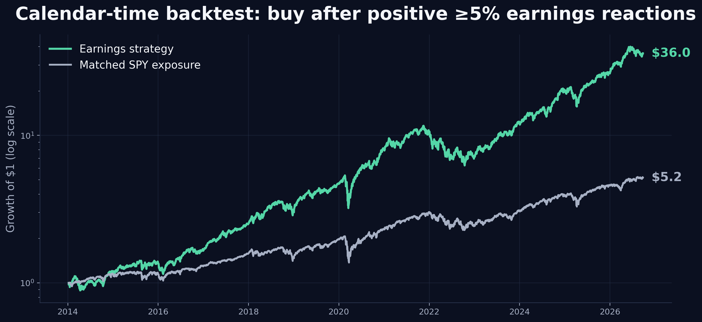

# Buy after earnings?

Code and results for an event study of large earnings reactions in current Nasdaq-100 stocks.

The question is simple: after a stock makes a large move around earnings, does the move tend to continue or reverse?

The primary analysis uses the stock's earnings-window return relative to SPY. Entry is defined only after the earnings reaction is observable, then forward performance is measured over 1 week, 1 month, 3 months, 6 months, and 1 year.

## Results from the September 2026 run

The completed run contains 4,423 usable earnings events across 100 current Nasdaq-100 tickers, starting in 2014.

For stocks with a **+5% or larger SPY-adjusted earnings reaction**, average excess return versus SPY was:

| Horizon | Mean excess return |
| --- | ---: |
| 1 week | 0.6% |
| 1 month | 1.6% |
| 3 months | 4.4% |
| 6 months | 10.3% |
| 1 year | 19.8% |

The positive-reaction group also outperformed the pre-specified neutral earnings group (-2% to +2% reaction). At 3 months the difference was about 3.5 percentage points, and at 6 months it was about 6.8 points.

The relationship generally became stronger as the positive earnings reaction became larger. Negative reactions were less clean: they did not behave like a simple mirror-image short signal, and longer-horizon returns often recovered.



A simple calendar-time backtest was also included as a sanity check. After a +5% reaction, the strategy holds each qualifying stock for 63 trading days, equal-weights active positions, and includes a small turnover cost. The backtest points in the same direction as the event study, but it should not be treated as a production strategy.



## Method

Earnings dates and adjusted prices are pulled with `yfinance`. The current Nasdaq-100 constituent list is pulled from Wikipedia and cached locally.

For each earnings event, the notebook calculates:

- raw earnings reaction;
- SPY-adjusted earnings reaction;
- pre-event market-model alpha and beta versus SPY;
- forward stock and SPY returns;
- forward excess return versus SPY;
- market-model abnormal forward return.

The threshold analysis uses fixed cutoffs of 2%, 5%, 10%, and 15%. Confidence intervals are estimated with a ticker-cluster bootstrap, and the tables also report BH-adjusted q-values. Ticker-equal summaries are included so companies with more observations do not automatically dominate the result.

## Run it

```bash
pip install -r requirements.txt
jupyter notebook buy_after_earnings.ipynb
```

The notebook creates `earnings_reaction_cache/` locally so repeated runs do not have to redownload everything. The compact CSV tables from the completed run are in `results/`.

## Important limitation

The default universe uses **current Nasdaq-100 constituents historically**. That introduces survivorship bias: companies that performed poorly and later left the index may be missing from earlier years. The notebook supports an optional `historical_nasdaq100_membership.csv` file with `Ticker`, `Start`, and `End` columns if a historical membership dataset is available.

Yahoo earnings timestamps are also convenient rather than exchange-grade data, so extreme events should be spot-checked before drawing conclusions from an individual observation.

This is an exploratory research project, not investment advice.
